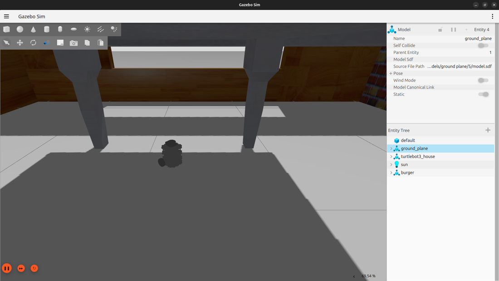
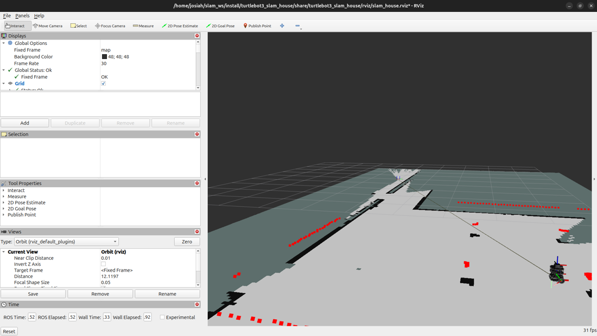
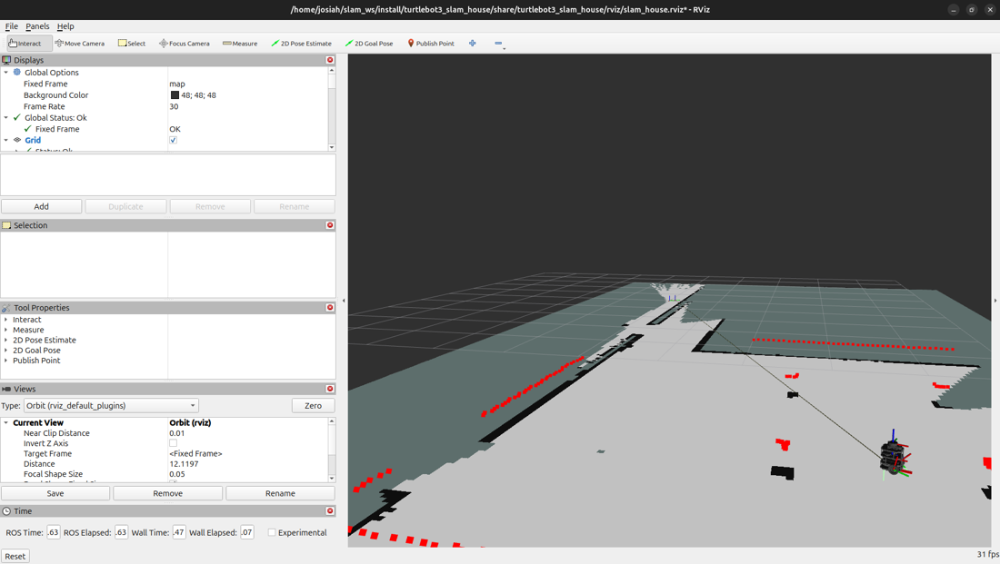
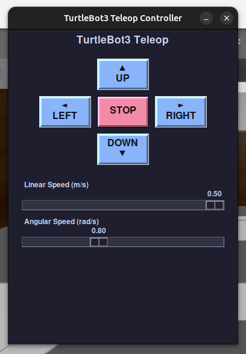

# TurtleBot3 Burger SLAM House Simulation (ROS 2 Humble Branch)

A ROS 2 package documenting the TurtleBot3 Burger SLAM simulation setup in a Gazebo house environment. This package features live online 2D mapping via `slam_toolbox`, pre-configured visualization in RViz2, and an intuitive custom Tkinter-based Teleop GUI controller.

> [!NOTE]
> **ROS 2 Distro Support**: This is the **`humble`** branch configured for **ROS 2 Humble** and **Classic Gazebo** (`gazebo_ros` / `gazebo_plugins`).
> For ROS 2 Jazzy (Gazebo Sim / `ros_gz`), please switch to the [`main`](https://github.com/JosiahSK/turtlebot3_slam_house/tree/main) branch.

<table>
  <tr>
    <td align="center"><b>Gazebo House Environment</b></td>
    <td align="center"><b>RViz2 2D Mapping (Complete)</b></td>
  </tr>
  <tr>
    <td></td>
    <td></td>
  </tr>
</table>

---

## Features

- **Gazebo House World**: Loads the standard TurtleBot3 House simulation environment in Classic Gazebo populated with walls, rooms, and obstacles.
- **2D Online SLAM**: Uses `slam_toolbox` (online async mode) with tuned mapping parameters.
- **RViz2 Visualization**: Automatically launches RViz2 pre-configured with Map, Robot Model, LaserScan, TF, and Footprint display plugins.
- **Custom GUI Teleop**: Includes a standalone Python Tkinter GUI featuring press-to-drive buttons, keyboard arrow key controls, spacebar emergency stop, and real-time speed sliders.

---

## Prerequisites

- **OS**: Ubuntu 22.04 LTS (Jammy Jellyfish)
- **ROS 2**: ROS 2 Humble Hawksbill
- **Simulator**: Classic Gazebo (Gazebo 11 / `gazebo_ros_pkgs`, `gazebo_plugins`)
- **Dependencies**:
  - `gazebo_ros_pkgs` (`sudo apt install ros-humble-gazebo-ros-pkgs`)
  - `turtlebot3` packages (`turtlebot3`, `turtlebot3_simulations`, `turtlebot3_msgs`) — `humble` branch
  - `slam_toolbox` (`sudo apt install ros-humble-slam-toolbox`)
  - `rviz2`
  - Python 3 with `tkinter` (`sudo apt install python3-tk`)

---

## Installation & Setup

1. **Clone the repository** into your ROS 2 workspace `src` directory on the `humble` branch:
   ```bash
   cd ~/slam_ws/src
   git clone -b humble https://github.com/JosiahSK/turtlebot3_slam_house.git
   ```

2. **Install TurtleBot3 Humble dependencies**:
   ```bash
   cd ~/slam_ws/src
   git clone -b humble https://github.com/ROBOTIS-GIT/turtlebot3.git
   git clone -b humble https://github.com/ROBOTIS-GIT/turtlebot3_simulations.git
   git clone -b humble https://github.com/ROBOTIS-GIT/turtlebot3_msgs.git
   ```

3. **Install system dependencies via rosdep**:
   ```bash
   cd ~/slam_ws
   rosdep update
   rosdep install --from-paths src --ignore-src -r -y
   ```

4. **Build the workspace**:
   ```bash
   cd ~/slam_ws
   colcon build --symlink-install
   ```

---

## Full Build & Launch Steps (Humble)

1. Note that the package must sit inside a `src/` folder of a workspace, e.g.:
   ```text
   ~/slam_ws/src/turtlebot3_slam_house/
   ```

2. Install dependencies:
   ```bash
   sudo apt update
   sudo apt install python3-tk
   cd ~/slam_ws
   rosdep install --from-paths src --ignore-src -r -y
   ```

3. Build the workspace:
   ```bash
   cd ~/slam_ws
   colcon build --symlink-install
   ```

4. Source the environment:
   ```bash
   source /opt/ros/humble/setup.bash
   source ~/slam_ws/install/setup.bash
   ```

5. Set the TurtleBot3 model:
   ```bash
   export TURTLEBOT3_MODEL=burger
   ```

6. Launch everything:
   ```bash
   ros2 launch turtlebot3_slam_house slam_house.launch.py
   ```

7. If the launch fails, verify the package is visible:
   ```bash
   ros2 pkg list | grep turtlebot3_slam_house
   ```

---

## Quick Start / Launch Instructions

Source your ROS 2 Humble environment, set the TurtleBot3 model, and execute the launch file:

```bash
source /opt/ros/humble/setup.bash
source install/setup.bash
export TURTLEBOT3_MODEL=burger
ros2 launch turtlebot3_slam_house slam_house.launch.py
```

This single launch command brings up:
1. **Classic Gazebo Simulator** (`gazebo_ros`) with TurtleBot3 Burger spawned in the House world (`spawn_entity.py`).
2. **`slam_toolbox`** node executing asynchronous 2D mapping.
3. **RViz2** displaying the live map generation.
4. **Teleop GUI Controller** for driving the robot.

---

## Known Limitations & Verification Note

> [!IMPORTANT]
> **Untested on Live ROS 2 Humble Machine**:
> This branch was updated to target ROS 2 Humble and Classic Gazebo (`gazebo_ros` / `gazebo_plugins`) based on official Humble package specifications and APIs. However, because the development host machine only has ROS 2 Jazzy installed, end-to-end launch and build execution on this branch could not be verified on a live ROS 2 Humble environment.
> If running on ROS 2 Humble, please verify that topic names (e.g. `/cmd_vel`, `/scan`, `/odom`, `/tf`) and spawning behavior function as expected.

---

## 2D SLAM Mapping in Progress

As the robot explores the environment, `slam_toolbox` processes laser scan data and wheel odometry to dynamically map out walls, doorways, and rooms:



---

## Driving the Robot (Teleop Controller)

The custom Teleop GUI (`teleop_gui.py`) automatically opens upon launch.

<p align="center">
  
</p>

- **On-Screen Directional Buttons**: Click and hold **▲ UP**, **◄ LEFT**, **▼ DOWN**, or **► RIGHT** to steer.
- **Keyboard Arrow Keys**: Focus the GUI window and use the **Up**, **Down**, **Left**, and **Right** arrow keys.
- **Emergency Stop**: Click the red **STOP** button or press the **Spacebar** to immediately halt robot movement.
- **Speed Adjustment**: Adjust the **Linear Speed** (0.02 – 0.50 m/s) and **Angular Speed** (0.10 – 2.00 rad/s) sliders dynamically while driving.

---

## How to Save the Map

Once you have explored the environment and built a satisfactory map in RViz:

1. Open a new terminal and source the workspace:
   ```bash
   source /opt/ros/humble/setup.bash
   source ~/slam_ws/install/setup.bash
   ```

2. Save the map using `nav2_map_server`:
   ```bash
   mkdir -p maps
   ros2 run nav2_map_server map_saver_cli -f maps/my_house_map
   ```
   This will generate `my_house_map.yaml` and `my_house_map.pgm`.

> **Note**: The `maps/` directory and `.pgm` image files are intentionally listed in `.gitignore`. Maps are generated local artifacts and are kept out of version control so users can map and save their own custom sessions.

---

## How to Reset / Restart Mapping

If you want to start a fresh mapping session without restarting the entire simulation:

### Method 1: Quick Service / Node Reset
Clear the current map data in `slam_toolbox` via ROS 2 service:
```bash
ros2 service call /slam_toolbox/clear_changes slam_toolbox/srv/Clear
```
Alternatively, reset the `slam_toolbox` lifecycle node:
```bash
ros2 lifecycle set /slam_toolbox shutdown
ros2 lifecycle set /slam_toolbox configure
ros2 lifecycle set /slam_toolbox activate
```

### Method 2: Full Relaunch
Terminate the running launch command in your terminal (`Ctrl+C`) and re-run:
```bash
ros2 launch turtlebot3_slam_house slam_house.launch.py
```

---

## Project Structure

```text
turtlebot3_slam_house/
├── CMakeLists.txt                        # CMake build configuration
├── LICENSE                               # Apache License 2.0
├── package.xml                           # ROS 2 package metadata and dependencies
├── README.md                             # Project documentation
├── .gitignore                            # ROS 2 workspace git ignore definitions
├── config/
│   └── mapper_params_online_async.yaml   # SLAM Toolbox online async mapping parameters
├── docs/
│   └── images/                           # Screenshots and visuals
│       ├── gazebo_house_world.png
│       ├── rviz_mapping_in_progress.png
│       ├── rviz_map_complete.png
│       └── teleop_gui.png
├── launch/
│   └── slam_house.launch.py              # Main bringup launch file (Gazebo + SLAM + RViz2 + Teleop GUI)
├── rviz/
│   └── slam_house.rviz                   # Pre-configured RViz2 display layout
└── scripts/
    └── teleop_gui.py                     # Standalone Tkinter GUI teleop controller node
```

---

## Reference Package Versions & Branches

- **ROS 2 Distribution**: ROS 2 Humble Hawksbill (Ubuntu 22.04 LTS)
- **`turtlebot3`**: `humble` branch
- **`turtlebot3_simulations`**: `humble` branch (`turtlebot3_gazebo` house world)
- **`turtlebot3_msgs`**: `humble` branch
- **`slam_toolbox`**: `humble` branch

---

## License

This project is licensed under the [Apache License 2.0](LICENSE).
